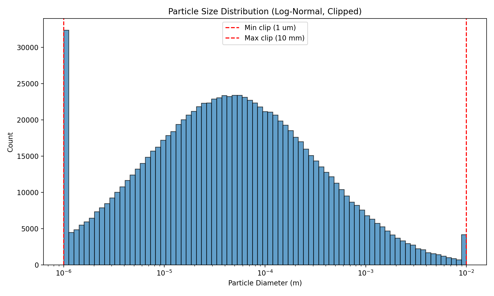
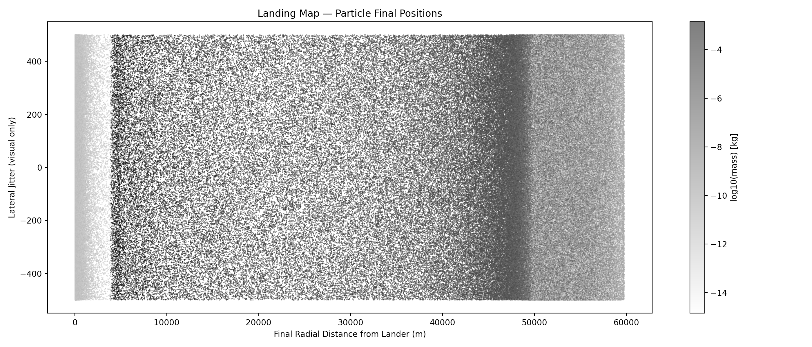
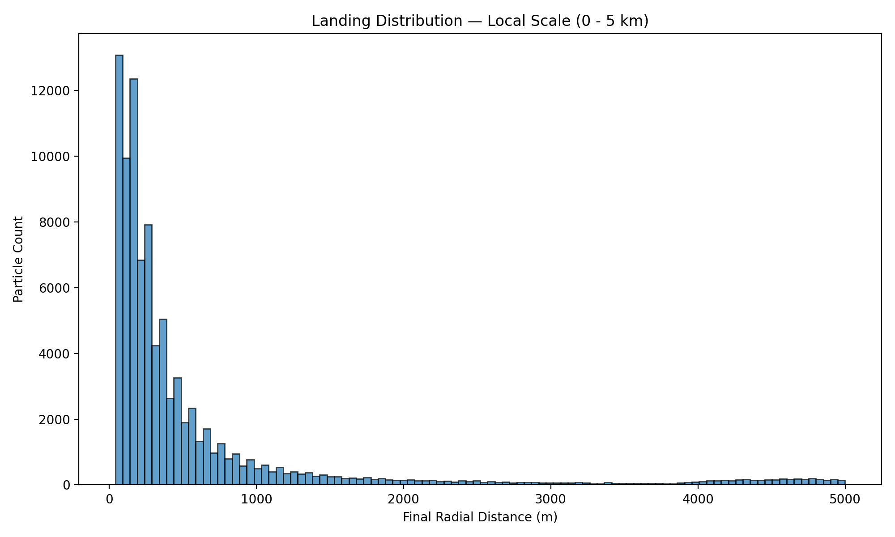
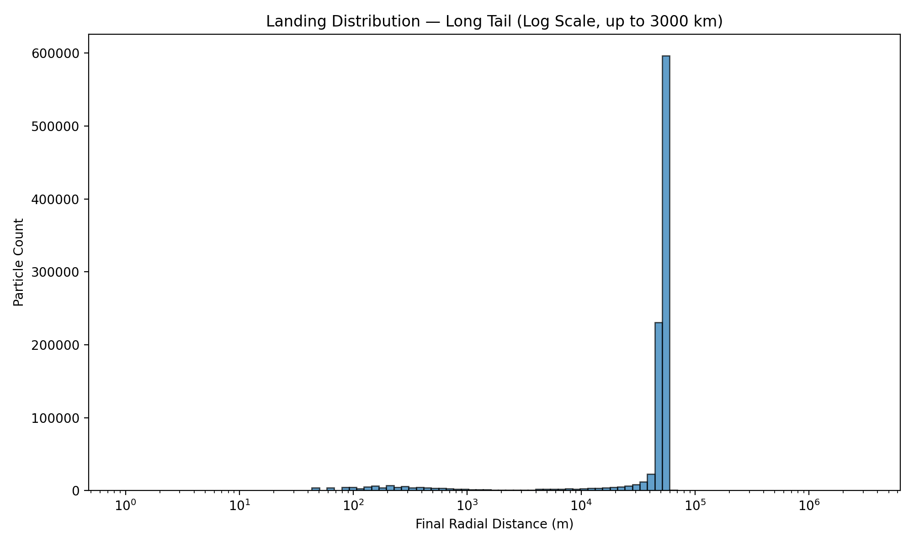
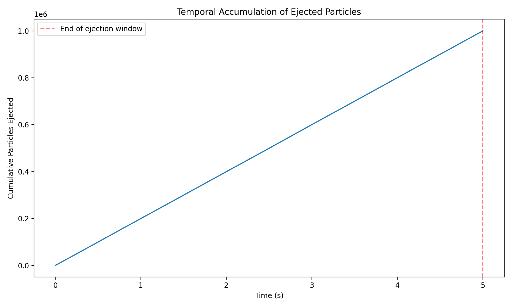
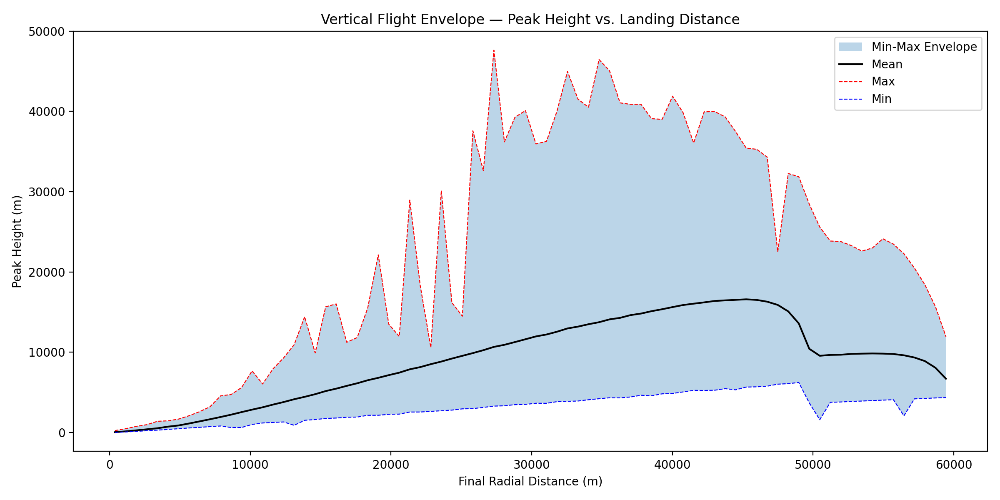

# Simulation Visualization Outputs

This document contains the visual data generated from the Lunar Regolith Simulation using the parameters defined in `Visualization.md`.

## 1. Particle Size Distribution
  
Shows the initial generated particle sizes adhering to a log-normal distribution, artificially clamped down to boundaries defined in the simulation initialization step.

## 2. Landing Map
  
Shows the final spatial positioning scaled horizontally via distance from the landing pad. Particles are styled by a logarithmic interpretation of their mass, allowing easy contrast of distance traversal vs mass.

## 3. Local Distribution Scale
  
Detailed view focusing tightly on the immediate vicinity spanning `0m` to `5000m`.

## 4. Long-Tail Distribution Scale
  
Highlights the extensive distances traversed by micron-scale lightweight dust using a logarithmic distance graph extending outwards entirely up to ~3000 kilometers!

## 5. Temporal Accumulation Curve
  
Depicts the stochastic start rate of the particles, displaying an active accumulation plateauing completely sharply upon hitting the predefined `5` second injection cutoff threshold.

## 6. Vertical Envelope Analysis
  
Depicts the full vertical hazard height (max/mean/min) against horizontal travel distance to demonstrate where in the spatial volume orbiting payloads might be hit.
